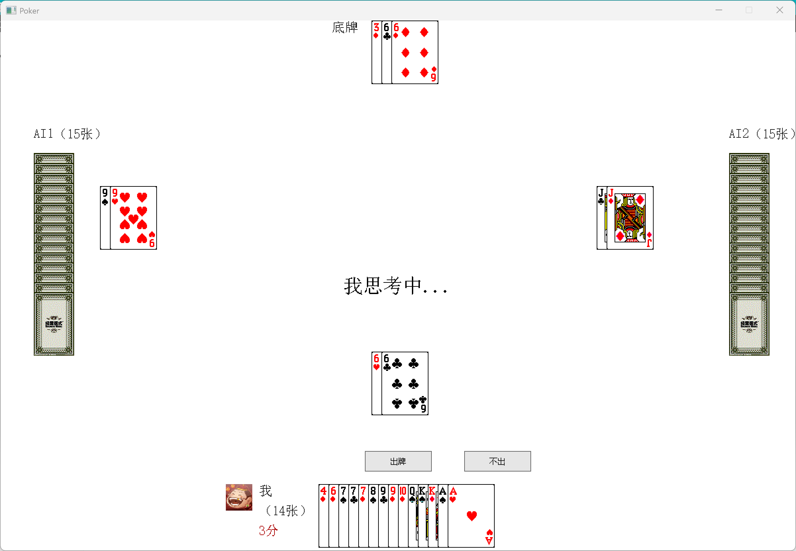

# 🃏 斗地主 (Poker) — C++ 版本

> 一款基于 C++ 和 EasyX 图形库开发的斗地主单机游戏，支持人机对战，实现了完整的叫分、出牌、牌型判断与 AI 决策逻辑。

------

## 📖 项目简介

本项目是经典扑克牌游戏**斗地主**的 C++ 桌面端实现，采用 Windows 图形库 **EasyX** 进行界面渲染，玩家（你）与两个 AI 对手进行对战。游戏完整还原了斗地主的核心规则：洗牌发牌 → 叫分竞地主 → 轮流出牌 → 判定胜负，并通过日志记录每局对局过程。

------

## ✨ 功能特性

- 🎮 **1 人 vs 2 AI**：玩家与两名 AI 同台竞技
- 🃏 **完整牌型识别**：支持全部 13 种斗地主牌型（单牌、对子、三带一、顺子、飞机、炸弹、王炸等）
- 🤖 **AI 自动决策**：AI 能自动叫分、寻找最小合法出牌或最小压制牌型
- 🖱️ **图形化交互**：鼠标点击选牌/出牌，UI 按钮触发叫分与出牌操作
- 📝 **游戏日志**：对局过程自动写入 `game_record.txt`
- ♻️ **重新开始**：游戏结束后可一键重置并重新开局
- 🏆 **地主标记**：界面实时标注当前地主身份

------

## 🖥️ 运行截图预览（界面布局）



------

## 🛠️ 技术栈

| 类别     | 说明                                             |
| -------- | ------------------------------------------------|
| 编程语言 | C++17                                            |
| 图形库   | [EasyX](https://easyx.cn/)（Windows 图形扩展库）  |
| 开发环境 | Visual Studio 2022（MSVC 编译器）                 |
| 目标平台 | Windows（x86 / x64）                             |
| 项目文件 | `Poker.vcxproj`（Visual Studio 项目）            |
| 构建类型 | Windows 桌面应用程序（GUI）                       |

------

## 📁 项目结构

```
Poker-cplusplus/
│
├── App.cpp                  # 程序入口，初始化窗口并启动游戏
│
├── Constants.h              # 全局常量（窗口尺寸、UI坐标、按钮位置等）
│
├── Poker.h / Poker.cpp      # 扑克牌数据结构（花色 + 点数 + 图片路径）
├── PokerType.h              # 牌型枚举（共13种）
├── PokerTypeUtil.h/.cpp     # 牌型识别工具类（判断与比较）
├── PokerUtil.h/.cpp         # 扑克工具类（洗牌、排序、生成牌堆等）
│
├── IPlayer.h                # 玩家接口（纯虚类）
├── BasePlayer.h/.cpp        # 玩家基类（手牌管理、出牌记录）
├── HumanPlayer.h/.cpp       # 人类玩家（鼠标点击选牌、出牌）
├── AIPlayer.h/.cpp          # AI玩家（自动叫分、自动出牌）
│
├── GameState.h/.cpp         # 游戏状态（单例，保存全局状态）
├── GameManager.h/.cpp       # 游戏主控制器（单例，协调各模块）
├── BidManager.h/.cpp        # 叫分阶段管理器（单例）
├── PlayManager.h/.cpp       # 出牌阶段管理器（单例，含AI决策）
│
├── Render.h/.cpp            # 渲染模块（所有绘图操作）
├── InputManager.h/.cpp      # 输入管理（鼠标/键盘事件处理）
├── Logger.h/.cpp            # 日志模块（记录游戏过程到文件）
│
├── Poker.vcxproj            # Visual Studio 项目文件
├── game_record.txt          # 游戏日志输出文件
└── README.md                # 项目说明文档
```

------

## 🏗️ 架构设计

### 整体架构

项目采用**分层架构**，各模块职责清晰：

```
┌──────────────────────────────────────────────────┐
│                   App.cpp (入口)                 │
└──────────────────┬───────────────────────────────┘
                   │
┌──────────────────▼───────────────────────────────┐
│               GameManager（游戏主控）             │
│    协调：BidManager / PlayManager / InputManager  │
└──────┬──────────────────────────┬────────────────┘
       │                          │
┌──────▼──────┐          ┌────────▼───────────┐
│  GameState  │          │   Render（渲染）    │
│ （全局状态）  │         │ InputManager（输入）│
└──────┬──────┘          └────────────────────┘
       │
┌──────▼──────────────────────────┐
│         玩家体系                 │
│  IPlayer（接口）                 │
│    ├── BasePlayer（基类）        │
│    │     ├── HumanPlayer        │
│    │     └── AIPlayer           │
└─────────────────────────────────┘
```

### 设计模式

| 模式            | 应用位置                                                     |
| --------------- | ------------------------------------------------------------ |
| **单例模式**    | `GameManager`、`GameState`、`BidManager`、`PlayManager`、`InputManager`、`Logger` 均为单例 |
| **接口/抽象类** | `IPlayer` 定义玩家接口，声明绘制和数据操作的纯虚函数         |
| **继承与多态**  | `BasePlayer` 实现通用逻辑，`HumanPlayer` 和 `AIPlayer` 各自重写绘制与操作方法 |
| **常量类**      | `Constants` 类集中管理所有 UI 坐标与尺寸，禁止实例化（`= delete`） |

------

## 🎮 游戏规则说明

### 游戏人数

3人：1名人类玩家 + 2名 AI（AI1 在左，AI2 在右）

### 游戏流程

```
洗牌 & 发牌
    │
    ▼
叫分阶段（Bidding Phase）
  · 每人轮流选择叫 1/2/3 分，或选择"不叫"
  · 叫分最高者成为地主，获得3张底牌（共20张）
  · 其余两人为农民（各17张）
    │
    ▼
出牌阶段（Playing Phase）
  · 地主先出牌
  · 后手必须出比上家更大的同类型牌，或选择"不出"
  · 连续2人不出则上一个出牌者获得新一轮出牌权
    │
    ▼
胜负判定
  · 某玩家手牌出完 → 该玩家获胜
  · 地主胜利 = 农民失败；农民任一方胜利 = 地主失败
```

### 支持的牌型（共13种）

| 牌型                          | 说明                     | 示例       |
| ----------------------------- | ------------------------| ---------- |
| 单牌 (SINGLE)                 | 任意一张                 | 3          |
| 对子 (PAIR)                   | 两张相同点数             | 66         |
| 三张 (TRIPLE)                 | 三张相同点数             | 888        |
| 顺子 (STRAIGHT)               | 5张及以上连续，不含2和王  | 34567      |
| 连对 (CONTINUOUS_PAIR)        | 3对及以上连续对子        | 334455     |
| 三带一 (TRIPLE_WITH_SINGLE)   | 三张 + 任意一张          | 888+3      |
| 三带二 (TRIPLE_WITH_PAIR)     | 三张 + 一对              | 888+55     |
| 飞机 (PLANE)                  | 2组及以上连续三张        | 888999     |
| 飞机带翅膀 (PLANE_WITH_WINGS) | 飞机 + 对应数量单牌/对子  | 888999+3+4 |
| 四带二 (FOUR_WITH_TWO)        | 四张 + 两张单牌          | 8888+3+4   |
| 炸弹 (BOMB)                   | 四张相同点数             | 7777       |
| 王炸 (ROYAL_BOMB)             | 大王 + 小王              | 🃟🃏       |
| 无效 (INVALID)                | 不符合任何牌型           | —          |

------

## 🤖 AI 决策逻辑

### 叫分策略

AI 叫分采用**随机策略**，在 0（不叫）到 3 分之间随机选择，模拟真实玩家不确定性。

### 出牌策略

AI 出牌采用**贪心最优策略**：

```
if 首家出牌 or 连续2人不出:
    → 出手中"最小合法牌型"（尽量保留大牌）
else:
    → 出能压制上家的"最小制胜牌型"
    → 若无法压制 → 不出（pass）
```

每次出牌前 AI 会**延迟 1 秒**，模拟思考过程，提升游戏体验。

#### AI 寻牌优先级

`PlayManager` 为 AI 提供了覆盖所有 11 种可出牌型的寻牌方法，包括：

- `findSmallest*()`：找到本类型中点数最小的组合
- `findWinning*()`：找到能压制上一手牌的最小组合

------

## 🧩 核心模块详解

### `GameState`（游戏全局状态）

集中存储游戏所有状态变量，是各模块共享数据的中枢：

```cpp
std::vector<Poker> bottom;                    // 3张底牌
std::vector<std::unique_ptr<IPlayer>> players; // 3名玩家
bool isBiddingPhase;                          // 叫分阶段标志
bool isPlayingPhase;                          // 出牌阶段标志
int landlordIndex;                            // 地主玩家索引
int currentBidderIndex;                       // 当前叫分玩家
int currentPlayerIndex;                       // 当前出牌玩家
int winnerIndex;                              // 胜利玩家索引
```

### `PokerTypeUtil`（牌型识别工具）

对外提供两个核心方法：

- `getPokerType(pokers)` — 识别一组牌的牌型，返回 `PokerType` 枚举值
- `compare(a, b)` — 比较两组牌的大小（需同类型，或 a 为炸弹/王炸）

内部通过 `getPointCountMap()` 构建点数频次映射表，再依次匹配各牌型规则。

### `PlayManager`（出牌管理）

负责整个出牌阶段的核心逻辑：

- **人类出牌**：解析鼠标事件，验证选中的牌是否合法，执行出牌或不出操作
- **AI 出牌**：调用 `findSmallestValidPlay()` 或 `findSmallestWinningPlay()` 获取最优出牌
- **回合管理**：维护 `passCount`（连续不出次数）、`lastPlayedCards`（上一手牌）
- **胜负判断**：`isGameOver()` 检测某玩家是否已出完所有手牌

### `Render`（渲染模块）

基于 EasyX 实现所有界面元素的绘制，包括：

- 玩家手牌（人类正面朝上，AI 显示牌背）
- 底牌展示区、出牌区域
- 玩家名称、手牌数量、叫分信息、地主标志
- UI 操作按钮

------

## 📦 编译与运行

### 环境要求

- **操作系统**：Windows 10 / 11
- **开发工具**：Visual Studio 2019 / 2022（推荐 2022）
- **图形库**：EasyX（需提前安装）

### 安装 EasyX

1. 前往 [EasyX 官网](https://easyx.cn/) 下载安装包
2. 运行安装程序，自动配置到 Visual Studio 环境中

### 编译步骤

```
1. 克隆仓库
   git clone https://github.com/xiabanglu/Poker-cplusplus.git

2. 打开项目
   双击 Poker.vcxproj 使用 Visual Studio 打开

3. 配置图片资源（重要！）
   游戏需要扑克牌图片资源，路径在 Poker 对象的 imgUrl 字段中定义
   请确保图片目录与可执行文件相对路径一致

4. 编译运行
   点击 Visual Studio 工具栏中的"本地 Windows 调试器"（F5）
   或使用"生成 → 生成解决方案"（Ctrl+Shift+B）后运行 .exe
```

### 目录结构建议

```
Poker/
├── Poker.exe          ← 编译输出的可执行文件
├── game_record.txt    ← 日志文件（自动生成）
└── images/            ← 扑克牌图片资源目录
    ├── spade_3.png
    ├── heart_A.png
    ├── ...
    └── giant_joker.png
```

------

## 🕹️ 操作说明

### 叫分阶段

| 操作             | 说明                |
| ---------------- | -------------------|
| 点击 **[叫1分]** | 叫1分竞争地主资格    |
| 点击 **[叫2分]** | 叫2分               |
| 点击 **[叫3分]** | 叫3分（最高优先级）  |
| 点击 **[不叫]**  | 放弃本轮叫分        |

### 出牌阶段

| 操作                 | 说明                                     |
| -------------------- | ----------------------------------------|
| **鼠标左键**点击手牌  | 选中/取消选中该张牌（选中后牌会上移）       |
| 点击 **[出牌]**      | 出选中的牌（系统自动验证牌型合法性）        |
| 点击 **[不出]**      | 本轮放弃出牌（仅在非首轮且有牌可不出时有效） |

### 通用操作

| 操作               | 说明                  |
| -------------------| ---------------------|
| 点击 **[重新开始]** | 重置游戏，重新洗牌发牌 |
| 点击 **[退出游戏]** | 关闭游戏窗口          |

------

## 📝 日志说明

每局游戏的对局记录会自动写入 `game_record.txt`，内容包括：

- 各玩家的初始手牌
- 底牌内容
- 每轮出牌记录（玩家名 + 出的牌）
- 游戏结果（胜利者）

日志文件便于复盘和调试。

------

## 🔧 扩展建议

以下是可进一步改进的方向：

1. **强化AI策略**：引入启发式搜索或强化学习，替代现有的贪心最小牌策略
2. **多局积分系统**：记录多局胜负，按叫分倍率计算积分
3. **音效支持**：集成 Windows 音频 API 添加出牌音效
4. **联网对战**：基于 WinSock 实现局域网多人对战
5. **动画效果**：为发牌、出牌过程添加过渡动画
6. **皮肤切换**：支持不同风格的扑克牌图片主题

------

## 📄 许可证

本项目目前未设置开源许可证，默认保留所有权利。如需使用或参考，请联系作者。

------

## 👤 作者

**xiabanglu**
 GitHub: [@xiabanglu](https://github.com/xiabanglu)
 仓库地址: https://github.com/xiabanglu/Poker-cplusplus

------

*本项目为个人学习与练手项目，用于探索 C++ 面向对象设计、图形界面开发及游戏逻辑实现。*
